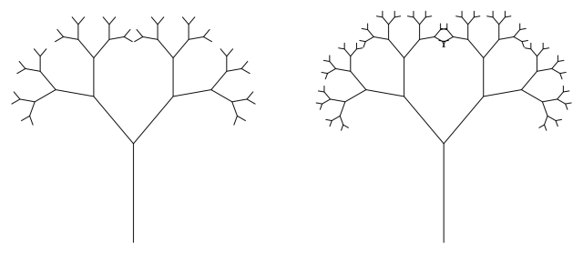

### Homework 4

1)  A = [[3], [5, 8], [9, 2, 6], [4, 7, 3, 1]],
    Path output: [Left, Left, Right].  
    Not sure what an optimization means in this context, if it means that a  
    computer scientist can use this algorithm instead of manual path  
    computation, in this case it optimizes developer's lifetime and makes  
    his life less depressive. This algorithm computes a most expensive path  
    from a top to a bottom.
   
2)  For the top element we don't need to compute a path complexity because  
    the top represents the only a single element. Also, if we pick up a  
    specific start point, then obviously we don't have to compute complexities  
    for his right and left neighbours. However, we don't need to compute  
    complexities for an upper level, because we can go only right or only  
    left. If the point for some reason is located at a corner then we need  
    to compute complexity for only a single point, because you simply can't  
    go to any more direction, only left or only right.
    
3)  If we replace loops by recursion calls inside the triangle-path-dynamic  
    function then it won't make any performance issues except additional   
    memory consumption. If we make triangle-path recursive itself then a time  
    complexity will be higher. **θ(2^n) > θ(n*m)**.  
    Any recursive solution consumes additional memory, because it generates  
    a same method calls with different parameters, simple loop does not do that.  
    
    A recursive call would look like a fractal tree but upside down.
    
    
    
4)  Substitution method  
    T(n) = 2T(n - 1) + 1 = 2(2T(n - 2) + 1) + 1 =  
    22T(n - 2) + 2 + 1 = 22(2T(n - 3) + 1) + 2 + 1 =  
    23T(n - 3) + 22 + 2 + 1  
    We see that with each substitution an exponentiation gets bigger by 1;  
    Since we've got to find the theta notation, we simply can skip constants,  
    then θ = (2n).  
    **θ(2^n) > θ(n*m)**, recursive method slower than dynamic.

5)  Is being updated
    
   